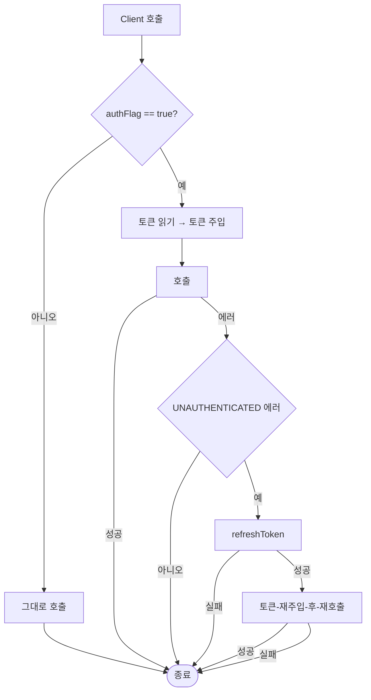
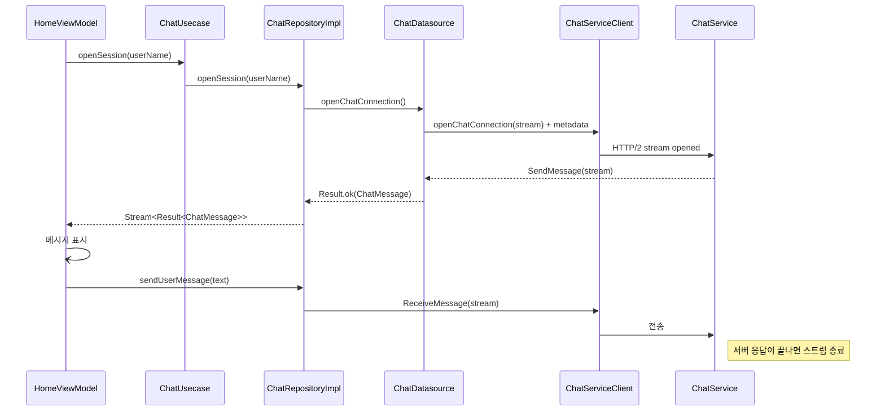
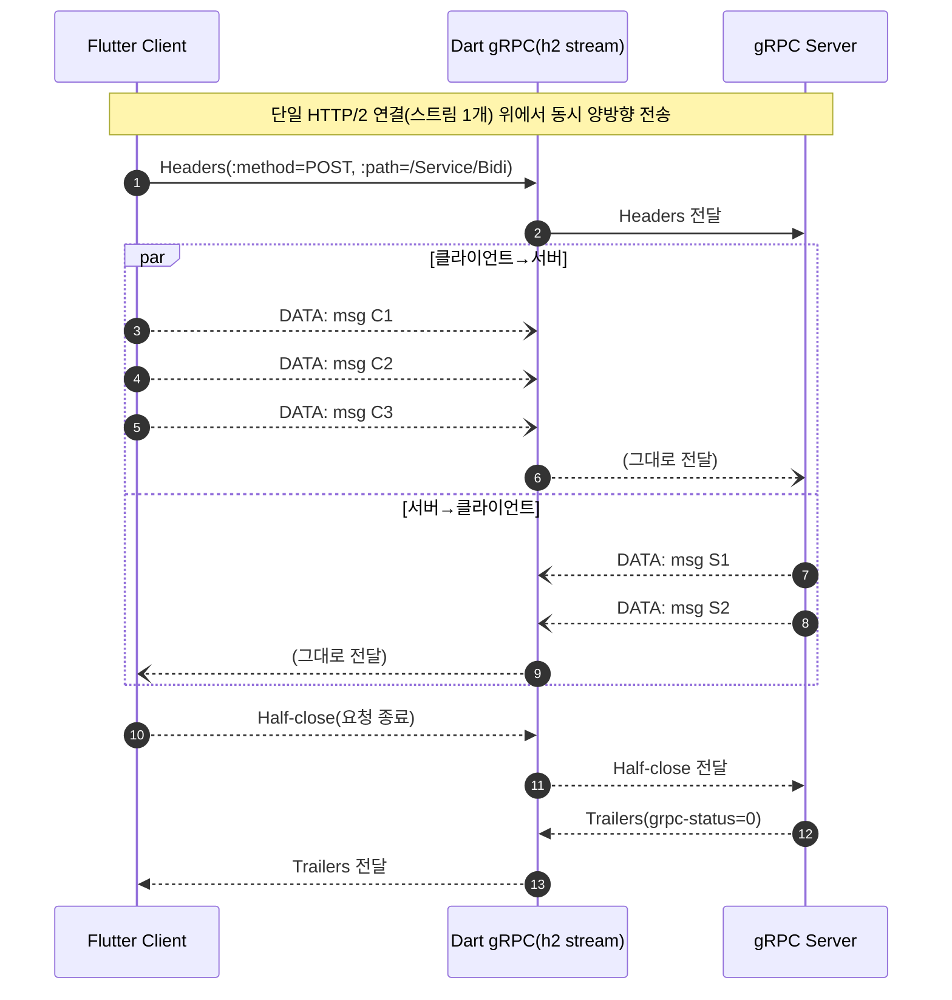

# gRPC Study Repo


## 데모 서버 실행
```bash
dart bin/server.dart
```


# 소개

gRPC를 Dart/Flutter에서 어떻게 구현하고 사용할 수 있는지를 데모로 만들었습니다.
/app-proto 디렉토리에 proto를 작성해놨으며, 명령어를 통해 생성할 수 있습니다.

gRPC관련 통신 유틸 코드들은 lib/core/util/grpc디렉토리에 위치해 있습니다.
(grpc interceptor, grpc datasource base, grpc stream handler등이 위치해있습니다)

data layer에 있는 각 도메인/기능 별 datasource들은 gRPC module의 채널을 주입받아 일관된 프로세스를 갖도록
해놨습니다.

## 네트워크 계층 구조
- Presentation: ViewModel이 유스케이스를 통해 도메인 명령을 수행합니다.
- Domain: UseCase -> Repository 인터페이스를 통해 인프라 계층과 분리된 비즈니스 로직을 유지합니다.
- Data: Repository 구현체가 Datasource에 위임해 gRPC Stub을 호출하고, Mapper가 Proto ↔ Domain 모델을 변환합니다.
- Infrastructure: `GrpcModule`이 채널과 인터셉터를 생성해 공통 설정(보안, 압축, 메타데이터)을 제공합니다.

## gRPC 통신 플로우
### 1. 인증이 필요 없는 Unary 호출 (로그인/토큰 갱신)
1. UI에서 전달된 입력을 `LoginUsecase`가 검증한 뒤 `AuthRepository`로 전달합니다.
2. Repository는 `AuthDatasource`를 통해 gRPC Stub (`UserLoginServiceClient`, `TokenServiceClient`)을 호출합니다.
3. `GrpcOptions.defaultCallOptions()`가 타임아웃과 공용 메타데이터(`x-language-code`)를 적용합니다.
4. 응답을 `AuthGrpcMapper`가 `TokenEntity`로 변환하고, `SecureStorageUtil`이 토큰을 저장합니다.

### 2. 인증이 필요한 호출 (로그아웃, 채팅 스트리밍)
1. Repository/Datasource가 CallOptions에 `x-requires-auth: true`를 설정합니다.
2. `AuthInterceptor`가 Access Token을 Authorization 헤더로 주입하고, 401 응답 시 `TokenUsecase.refreshToken()`을 통해 한 번 재시도합니다.
3. `LoggingInterceptor`가 요청/응답 Proto를 JSON으로 직렬화해 디버깅 로그를 남깁니다.


### Auth Interceptor


### 3. 채팅 양방향 스트리밍





`ChatDatasource`는 `GrpcDatasourceBase`를 상속받아 DI로 주입된 스트리밍 전용 채널(`@Named('stream_channel')`)과 인터셉터를 재사용합니다. 스트림 연결과 해제를 `GrpcBidirectionalStreamHandler`가 담당하며, 모든 응답을 `Result` 타입으로 래핑해 도메인이 통일된 오류 처리를 수행할 수 있게 합니다.

## 토큰 수명주기
- 로그인 성공 시 Access/Refresh Token을 `SecureStorageUtil`에 저장합니다.
- 앱 실행 시 `SplashViewModel`이 저장된 토큰 존재 여부를 확인하고 `TokenUsecase.refreshToken()`으로 세션을 연장합니다.
- 인증 API 실패 또는 강제 로그아웃 시 `LogoutUsecase`가 gRPC 로그아웃 요청 결과를 그대로 UI에 전달하고, 로컬 토큰은 항상 정리해 상태 불일치를 방지합니다.

## 참고: 공통 gRPC 유틸
- `GrpcOptions`: Unary/Streaming CallOptions에 타임아웃과 공통 메타데이터를 적용합니다.
- `GrpcBidirectionalStreamHandler`: 양방향 스트림을 열고, 응답 스트림을 `Result`로 변환하며, 구독/종료/에러 처리를 캡슐화합니다.
- `grpc/interceptor/*`: 인증 토큰 주입, 재시도, Proto JSON 로깅 등 클라이언트 공통 교차 관심사를 분리합니다.


# gRPC Proto 파일 생성 명령어

```bash
protoc \
 -I=app-proto \
 -I="$(brew --prefix)/include" \
 $(find app-proto -name '*.proto') \
 --dart_out=grpc:lib/generated/ \
 google/protobuf/empty.proto \
 google/protobuf/timestamp.proto

```
